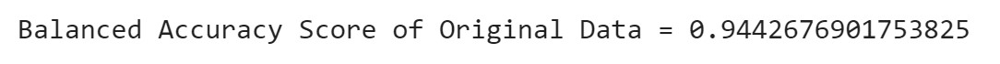
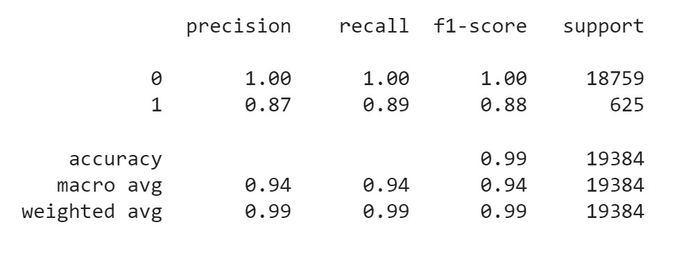
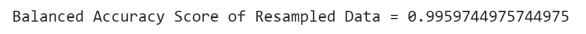
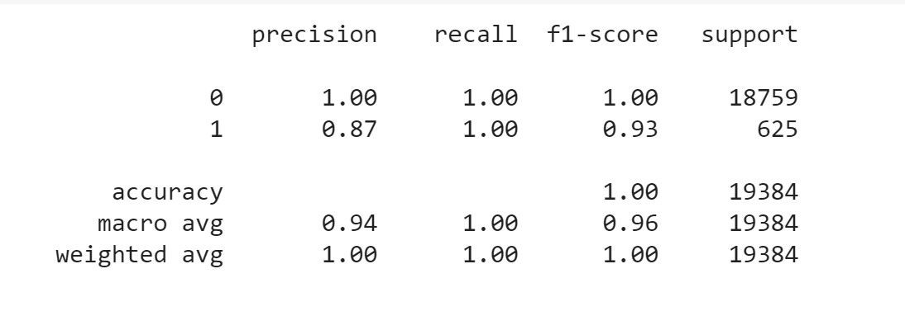

# credit-risk-classification
# CREDIT RISK CLASSIFICATION : SUPERVISED MACHINE LEARNING MODEL

# Credit Risk Analysis Report
# OVERVIEW:
The purpose of this analysis is to build a model that can identify the creditworthiness of borrowers.
A dataset of historical lending activity from a peer-to-peer lending services company was used.
Dependant variable (y value) in this analysis was the "loan status" indicating if a loan is healthy or at risk.
Independent Variables (x values) were loan size, interest rate, borrower income, debt to income ratio, number of accounts and derogatory marks.
In this analysis, we first split our data to traning and test sets. Then, define our dependent and independent variables. Next, we create logistic regression model and fit our original data to this model. Trained model is used to make predictions. Lastly, we evaluate the model`s performance.
Two diffeent Logistic Regression models were created by using the original data set and randomy over resampled data set (to get rid of the imbalances). In the end, their results -which was gathered with scikit-learn library- were compared.

# RESULT:

# Logistic Regression Model with Original Data

1. Precision: The model was 100% precise in predicting healthy loans, while the model was only 87% precise in predicting high-risk loans.
2. Accuracy: 94%
3. Recall: The model had 100% recall in predicting healthy loans, but 89% recall in predicting high-risk loans.

# Logistic Regression Model with Randomly Oversampled Data

1. Precision: The model was 100% precise in predicting healthy loans, while the model was only 87% precise in predicting high-risk loans.
2. Accuracy: 100%
3. Recall: 100%

# RESULT SUMMARY

The above study shows that, both models accurately predict healthy loans, they differ in their ability to predict high risk loans.

In relation to high risk loans, though model 1 performed well, a key concern was the recall score (at 0.89), given the risk and potential cost to the business in misclassifying a high risk loan as healthy. However model 2 removed this concern, being able to accurately classify actual high risk loans as high risk (with a value of 1.00).

Both models score the same on precision in predicting high risk loans (at 0.87), meaning some healthy loans are being predicted as high risk. Which could potentially run the risk of losing business as a result.

Based on the analysis undertaken, model 2 (which used resampled training data) is the strongest performing model in predicting whether a loan is healthy or high risk. Given its performance I would recommend the company use model 2. However, I also recommend the company to consider other lending factors while concluding final decision.

